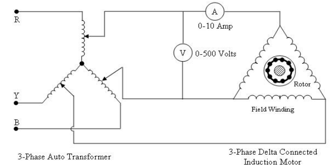
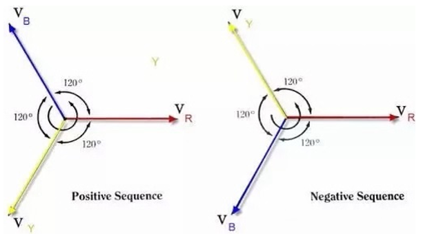

<h3> Theory </h3>

When a 3-phase electric supply is given to this type of motor it does not require any starting device  <b>“3-Phase Induction motor is also called a Self-Starting device “ </b>  
  

  
    
Three phase induction motor mainly construct of two part – 
  <b>1.	Stator </b> 
  <b>2.	Rotor</b> 
  <b>Stator :</b> The stationary part of the motor is known as stator .it consist of a three phase winding which are termed as R, Y, B . 
  <b>Rotor :</b> The rotating part of a motor is known as rotor they are generally two type of rotor in 3-phase induction motor 
  <b>a)	Squirrel cage rotor</b>  
  <b>b)	Phase wound or wound rotor.</b> 
  At time of starting 3-phase induction motor draw heavy current this current is reduced by reducing the starting voltage with the help of 3-phase autotransformer.
 

 <h4>Let’s understand the working of 3-phase induction motor </h4>
  
 

    
Here R, Y, B are the phases of 3-phase induction motor  
For a clockwise rotation of motor we generally used positive sequence of (RYB) to a 3-phase winding where connection are given as – 
R is connected first terminal of autotransformer of starter ,  
Y is connected to second terminal of autotransformer of starter , 
B is connected to Third terminal of starter , 
The total three output terminal are connected to 3 winding of three phase induction motor , 
  <h2> Formula to be Used </h2>
  <b> Speed of rotor </b>
  <h4> Nr= (1-Es/Er)Ns </h4> 
  where, Ns= 120f/p 
  Er= Running Voltage  
  Es= starting voltage  
  f= 50Hz  
  Number of pole of motor = 4 
For measurement of voltage we simply connect two terminal input starter to voltmeter terminal . 
For measurement of current draw in motor we simply connected one terminal of ammeter to one input of starter terminal and one terminal of ammeter to one terminal of motor  
By doing all this connection we simply power on and obtain a clockwise moving of a 3-phase induction motor .                                                                       To calculating the speed of 3-phase induction motor we mainly use “TECHOMETER” 

When 3-phase supply is given in negative sequence (RBY) to the three phase winding of stator of induction motor it produces rotating magnetic  field in anticlockwise direction .                                      therefore for reversing the direction of three phase induction motor we simply interchange any two terminal of 3-phase supply. 
  For obtaining the reversing running condition of a 3-phase induction motor we do all the connection in similar way but one thing we should to do this to just interchange of any two terminal of 3-phase supply of the system . 
  
