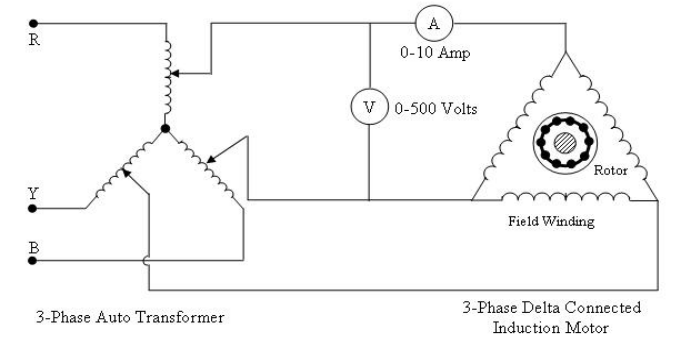
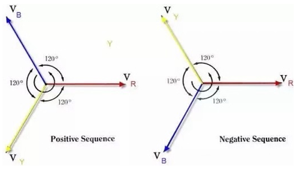

<h3> Theory </h3>

  <b>“A three-phase induction motor is an AC motor that runs on a three-phase power supply and converts electrical energy into mechanical energy using electromagnetic induction.“  </b> <b>3-Phase Induction motor is called a Self-Starting device</b> because when a 3-phase electric supply is given to this type of motor it does not require any starting device. This experiment helps us understand how the motor operates and shows that its direction of rotation can be easily changed by swapping any two of the three supply wires, an important aspect in electrical machines as it provides a practical understanding of motor behavior, control, and applications.   
  

  
    
Three phase induction motor mainly constructed of two part – 
  <b>1.	Stator </b> 
  <b>2.	Rotor</b> 
  <b>Stator :</b> The stationary part of the motor is known as stator .it consists of a three phase winding which are termed as R, Y, B . 
  <b>Rotor :</b> The rotating part of a motor is known as rotor there are generally two types of rotors in 3-phase induction motor 
  <b>a)	Squirrel cage rotor</b>  
  <b>b)	Phase wound or wound rotor.</b> 
  At the time of starting, a 3-phase induction motor draws heavy current this current is reduced by lowering the starting voltage with the help of a 3-phase autotransformer.
 

 <h4>Let’s understand the working of a 3-phase induction motor </h4>
  
 

    
Here R, Y, B are the phases of 3-phase induction motor  
For a clockwise rotation of motor we generally used positive sequence of (RYB) to a 3-phase winding where connections are given as – 
R is connected first terminal of autotransformer of starter ,  
Y is connected to second terminal of autotransformer of starter , 
B is connected to Third terminal of starter , 
The total three output terminal are connected to 3 winding of three phase induction motor , 
  <h2> Formula to be Used </h2>
  <b> Speed of rotor </b>
  <h4> Nr= (1-Es/Er)Ns </h4> 
  where, Ns= 120f/p 
  Er= Running Voltage  
  Es= starting voltage  
  f= 50Hz  
  Number of pole of motor = 4 
For measurement of voltage, we simply connect the two input starter terminals to the voltmeter terminals. 
For measurement of current drawn by the motor, we simply connect one terminal of the ammeter to one input of the starter terminal.  
By making all these connections, we simply power on and observe the clockwise movement of the 3-phase induction motor.                                                                       To calculate the speed of 3-phase induction motor we mainly use "TACHOMETER" 

When 3-phase supply is given in negative sequence (RBY) to the three phase winding of stator of induction motor it produces rotating magnetic  field in anticlockwise direction .                                      therefore for reversing the direction of three phase induction motor we simply interchange any two terminal of 3-phase supply. 
  For obtaining the reversed running condition of a 3-phase induction motor we do all the connection in similar way but one thing we should do this to just interchange of any two terminal of 3-phase supply of the system . 
  
